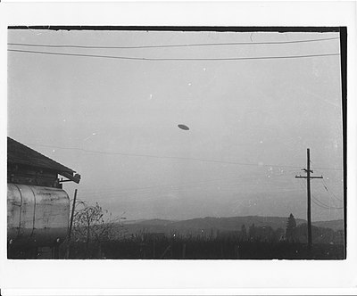
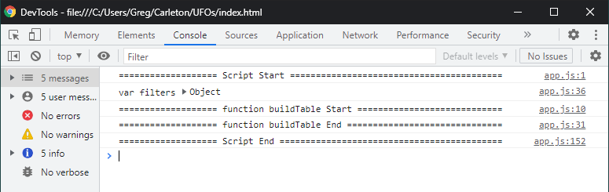
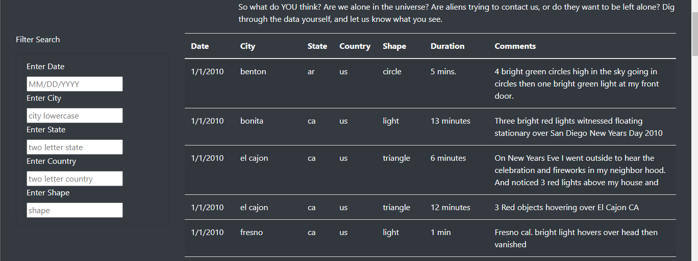
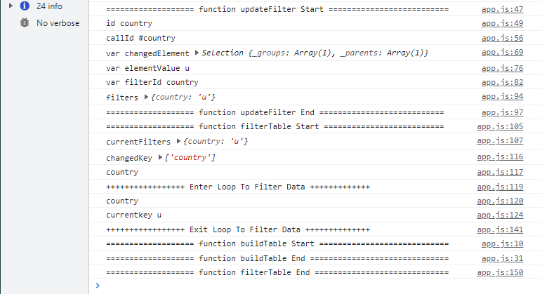
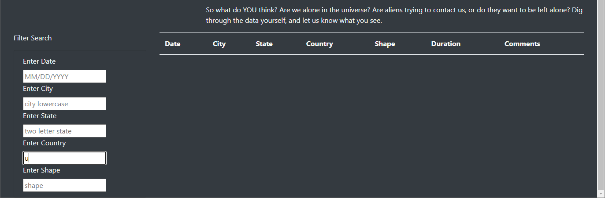
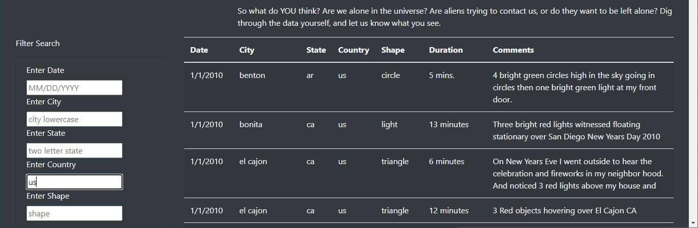
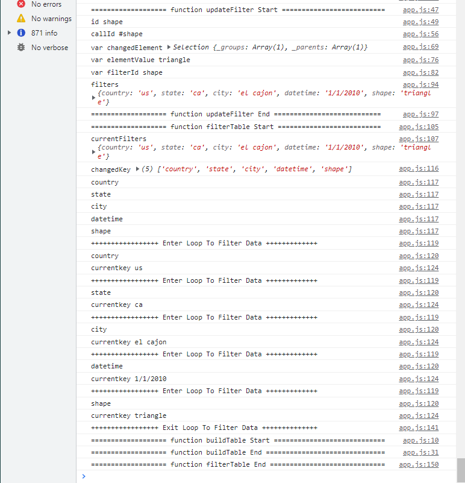
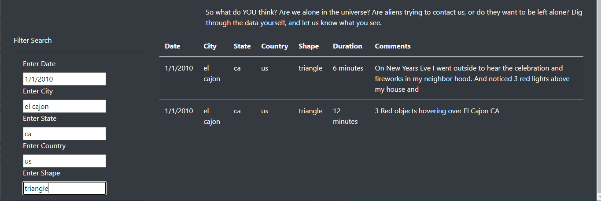
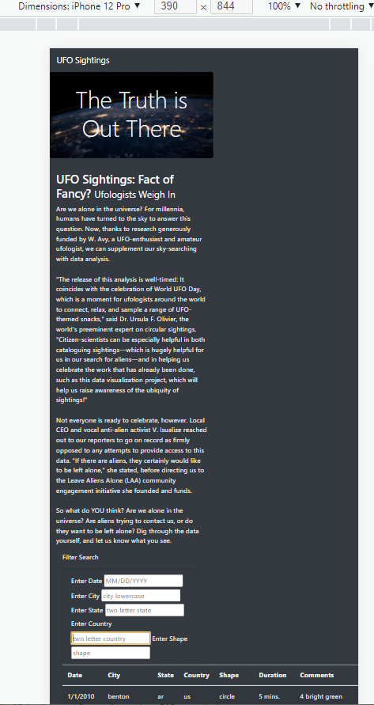

# UFO Sightings Filtered on Multiple Criteria

## 1 Overview of Project

Dana is a data journalist, a job which involves writing articles based on the findings from data analysis.   She is at a point in her career where she has the freedom to pick and choose what she wants to write about and she now has an opportunity to write about her home town McMinnville, Oregon and in particular UFO sightings.  In May of 1950, a farming couple, Paul and Evelyn Trent took a number of photographs of a UFO sighting the were published in Life magazine.  The image shown in figure 1 below was taken from https://en.wikipedia.org/wiki/McMinnville_UFO_photographs and has been embedded here for your convenience.



***Figure 1 - McMinnville UFO Photograph***

Data has access to a large file of UFO data, contained in the file data.js, and she wants to create a website that will be displayed online to allow users to filter for multiple criteria at the same time. She has the code working for a single criteria, date, but she wants to add additional table filters for the city, state, country, and shape.

## 2 Results

To help Dana get a good understanding of how the website works I have done one very important thing: ***I have added numerous console.log statements to the code*** . These written statements to the console can be accessed by right clicking anywhere on the website and selecting "inspect".  At the top of the  browser screen that opens select "Console" and you will be able to see all the information that I felt would be of value to help you understand how the website works.  You should also know that during the development of the JavaScript file, app.js, I used the console.log command extensively to debug the original code.  The following sections will explain, using both the console and website outputs, how the code is structured and how to use the website.

Here is what can can found in section 2:

- Section 2.1 describes how the website works
- Section 2.2 describes how the list elements have been changed to accommodate the search requirements
- Section 2.3 describes the innerworkings of the JavaScript that drives the dynamic parts to enable the website searches

### 2.1 The webpage

When you first access the website a variable, "filters" is defined that will continue throughout your session to capture filter information of your choosing.  In figure 2 below you can see that the app.js file starts, creates a the variable "filters" (which at start is empty {}) and then builds a table view of the data.



***Figure 2 - Console Log of Initial Page Load***


Figure 3 below shows the initial state of the website before any filter data has been applied.  Also notice that the default information in the input fields has been set to help the user understand what the format of the input should look like.



***Figure 3 - Initial Load UFOs Website***

The inputs can be selected in any order the the user would like.  You can see in the console view of figure 4 below that as soon as the user begins to type the application is listening and a call is made to the updateFilters function.  



***Figure 4 - Console Log Start Filtering Data***

Since the first key to be changed was 'country' and the user input is not yet complete no rows are shown in figure 5a.



***Figure 5a - UFOs Website Start Filtering***

When the user types the next character "s" the search then matches the code for the United States and all the data for "us" records are displayed.



***Figure 5b - UFOs Website Filter Country***


Continuing to refine the search the user then adds criteria in any order they like, continuing to refine and target the resulting data that is displayed.  In the case in figure 6 below you can see, by looking at the console log for "filters" that the user selected "filters {country: 'us', state: 'ca', city: 'el cajon', datetime: '1/1/2010', shape: 'triangle'}"




***Figure 6 - Console Log 5 Element Filter***


The result of this search can be seen in figure 7 below, with only two observation - which seem to support each other.



***Figure 7 - Website 5 Element Filter***


### 2.2 The List Element

The original website index.html had a button that was waiting for a click event, see section 2.3.1 about the app.py for more details on the listener.

```html
<!-- <li class="list-group-item bg-dark">
	<button id="filter-btn" type="button" class="btn btn-dark">Filter Table</button>
</li> -->
```

The new website now has five input fields that pass the "id" to the function "updateFilters" on a key up event.  It should be noted at this time that the onkeyup event is superior to the onkeydown event  because key down would require one additional user key stroke, such as a return of tab, after the user have entered their information. The listener in app.js is looking for the change event and is able to capture the input value of that id to update the filters. 

```html
<li class="list-group-item  bg-dark">
	<label for="date">Enter Date</label>
	<input type="text" placeholder="MM/DD/YYYY" id="datetime" onkeyup="updateFilters(id)"/>
	<label for="city">Enter City</label>
	<input type="text" placeholder="city lowercase" id="city" onkeyup="updateFilters(id)"/>
	<label for="state">Enter State</label>
	<input type="text" placeholder="two letter state " id="state" onkeyup="updateFilters(id)"/>
	<label for="country">Enter Country</label>
	<input type="text" placeholder="two letter country" id="country" onkeyup="updateFilters(id)"/>
	<label for="shape">Enter Shape</label>
	<input type="text" placeholder="shape" id="shape" onkeyup="updateFilters(id)"/>
</li>
```


### 2.3 The app.js JavaScript File

The app.js file has the following dynamic components that interact with the website:

- an event listener
- a function to update the filters that the user has entered
- a function to extract only the records that are of interest to the user

#### 2.3.1 The Event Listener

The event listener is modified to detect changes to each filter in the `app.js` file, the first listener was looking for a click event

```javascript
d3.selectAll("#filter-btn").on("click", handleClick);
```

The second listener was looking for a change event, and the change was defined by the onkeyup in the index.html file.

```javascript
d3.selectAll(".filter").on("change", updateFilters);
```


#### 2.3.2 The `updateFilters()` Function

The "id" that is returned to the updateFilters function is saved and used to complete the select statement that reads the value that was entered by the user and creates the "currentFilters".

```javascript
let text1 = "#";
let callId = text1.concat(id);
changedElement = d3.select(callId)
```


#### 2.3.3 The `filterTable()` Function

Passing the currentFilters to the filterTable function the original tableData is then filtered for display on the website.

```javascript
if (element) {
  filteredData = filteredData.filter(row => row[element] === currentkey);
}
```


## 3 Summary

The website as designed works very well as does address Dana's specified requirements however, in section 3.1 and 3.2 we will discuss shortcomings of the current design as well as other recommendations for how it can be improved to enrich the user experience and the utility of its analysis capabilities.  The data set that was available for analysis, well not insignificant, was not very big - as the size of the data set increases the value of a refined search and analysis capabilities would become much more obvious.  Hopefully Dana with see this value and let us help her with this work.

### 3.1 Drawback of the Design

One thing I see that may be a better design would be to change the match criteria so that the screen is never empty.  For example typing a "u" could pull up not only "us" but also onther countries like those shown in the example in table 1 below.  This was particularly annoying as I was search for the city of  "el cajon", I had to copy it from the screen because I couldn't remember how to spell it.  Case sensitivity is also an issue, "us" and "US" should achieve the same search result.

| Code   | Country        |
| :----- | :------------- |
| **UA** | **Ukraine**    |
| UK     | United Kingdom |
| US     | United States  |
| UZ     | Uzbekistan     |

***Table 1 - Example of Continuous Search Criteria***

Another drawback of the design is that it is not mobile ready, as can be seen in the iPhone 12 Pro view of the website in figure 8 below.  The table of data, is great, but the other elements do not scale well at all.



***Figure 8 - Website Not Mobile Ready***

### 3.2 Recommendations for further Development

Aside from the more obvious problems with the usability of the website, here are a few recommendations that will ready make the website a more valuable research tool.

#### Key Word Search of Comments:

The comments sections is rich with information that has not been extracted into any of the other elements.  Adding the ability to openly search the comments section for whatever the user was interested into would be very valuable.  For example the colour green is shown in the first row - it would be nice to be able to search for the word "green" to see if their are other comments that include that word.

#### Logical OR Search Capability to Criteria:

Currently the website facilitates a logical AND between the various input fields.  It would be very useful to be able to search a logical OR criteria within an input field.  The user you could then, for example, search cities that are know to be close to each other to find out if there were reported cases that affected a wider area than just one city.

#### Dropdowns for Input Entry:

If it is not visible in the first few lines than the user really doesn't know what selections are available for use.  For example what are all the choices for shape that can be used or how many countries are there in the available data.

#### Statistical Search Capability:

A statistical search capability would be a very useful feature to facilitate an in-depth analysis of the available data, including but not limited to:
- What location reported the most sightings?  This could be done for the city, state and country criteria.
- What is the frequency of different key words in the comments section?  This may require additional work to extract words of interest.
- Logically grouping the list by statistics would be good for finding patterns, for example using AND and OR combined with frequency could be very helpful.

